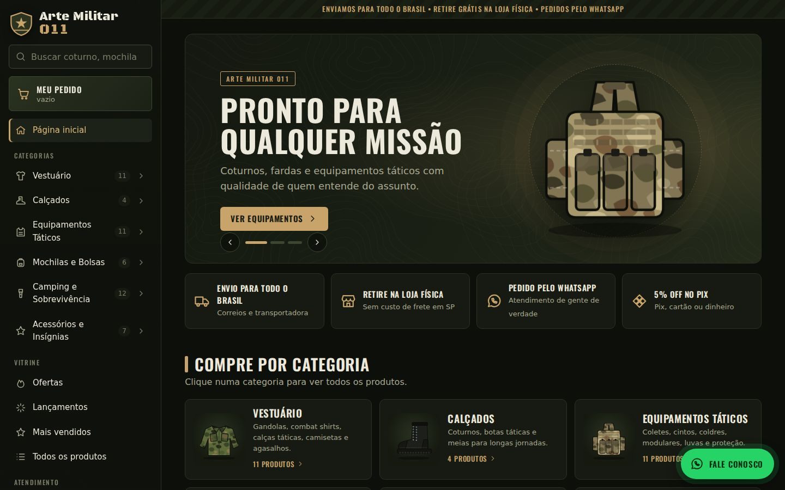
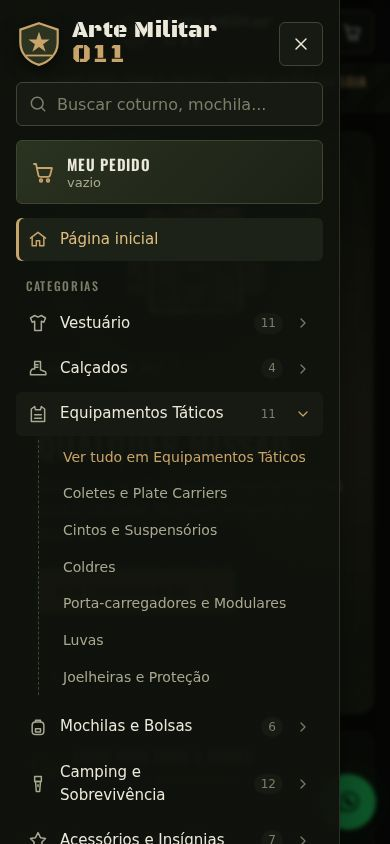
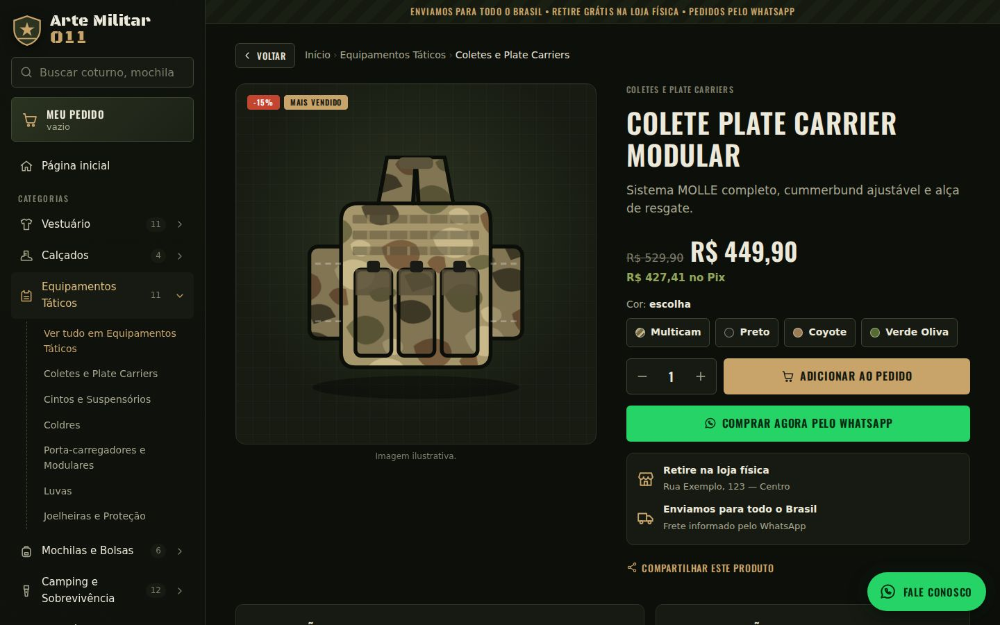
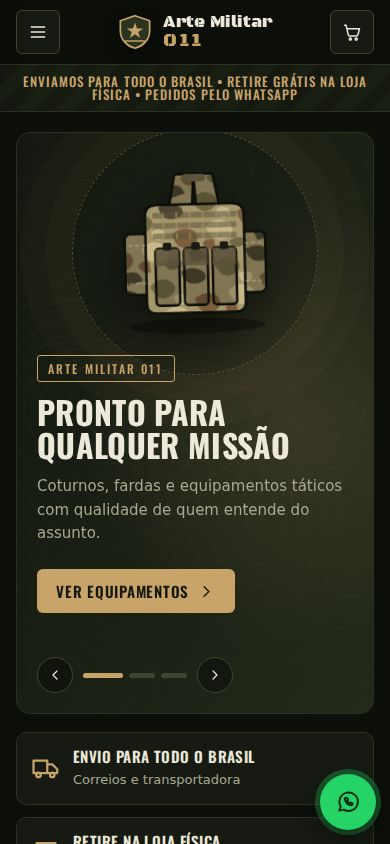

# Arte Militar 011 — Loja virtual

>  

## 📌 Sobre
Site de vendas da **Arte Militar 011**: artigos militares, táticos e de aventura. O cliente navega pelo **painel lateral à esquerda**, escolhe tamanho e cor, monta o pedido e **envia tudo pronto para o WhatsApp Business** da loja. Tem página da **loja física com mapa**, contatos, perguntas frequentes e histórico de pedidos.

🌐 **Site no ar:** https://williancoder.github.io/WillCoder01/PROJETOS/arte-militar-011/site/
(publicado automaticamente pelo GitHub Pages a cada alteração na `main`)

## 📸 Imagens
| Computador | Celular (menu aberto) |
|---|---|
|  |  |
|  |  |

## ✅ Antes de divulgar — troque os dados de exemplo
Tudo isso fica em **um único arquivo**: [`site/js/config.js`](site/js/config.js).

- [ ] `contato.whatsapp` — **seu número do WhatsApp Business** (só números: `55` + DDD + número). Todos os pedidos vão para ele.
- [ ] `contato.whatsappExibicao`, `telefone`, `telefoneExibicao`, `email`, `instagram`
- [ ] `lojaFisica` — endereço, CEP, `enderecoMapa` (o que você digitaria no Google Maps) e horários
- [ ] `produtos.js` — seus produtos e preços reais (os atuais são exemplos)
- [ ] Fotos reais dos produtos ([como colocar](docs/PRODUTOS.md#fotos))

## 🧭 O que editar e onde
| Quero mudar… | Arquivo | Guia |
|---|---|---|
| WhatsApp, telefone, e-mail, redes sociais | `site/js/config.js` → `contato` | [Guia de edição](docs/GUIA-DE-EDICAO.md#1-contatos) |
| Endereço, mapa e horários da loja | `site/js/config.js` → `lojaFisica` | [Guia de edição](docs/GUIA-DE-EDICAO.md#2-loja-física-e-mapa) |
| Produtos, preços, fotos, tamanhos, cores | `site/js/produtos.js` | [Produtos](docs/PRODUTOS.md) |
| Categorias e subcategorias do menu lateral | `site/js/config.js` → `categorias` | [Guia de edição](docs/GUIA-DE-EDICAO.md#5-categorias-do-menu-lateral) |
| Banners da página inicial | `site/js/config.js` → `banners` | [Guia de edição](docs/GUIA-DE-EDICAO.md#4-banners-da-página-inicial) |
| Entregas, pagamentos, desconto Pix, aviso do topo | `site/js/config.js` → `pedidos` | [Guia de edição](docs/GUIA-DE-EDICAO.md#3-pedidos-entrega-pagamento-e-pix) |
| Textos "Sobre", trocas e privacidade | `site/js/config.js` (final do arquivo) | [Guia de edição](docs/GUIA-DE-EDICAO.md#7-textos-institucionais) |
| Cores do site | `site/css/estilo.css` → bloco `:root` | [Guia de edição](docs/GUIA-DE-EDICAO.md#8-cores-e-fontes) |
| Título no Google / prévia no WhatsApp | `site/index.html` (topo) | [Publicar](docs/PUBLICAR.md#google-e-prévia-do-link) |
| Pagamento pelo site (futuro) | `site/js/pedido.js` → `FINALIZADORES` | [Pagamentos](docs/PAGAMENTOS-FUTURO.md) |

> Dá para editar **direto no GitHub pelo navegador** (abra o arquivo → ícone de lápis → "Commit changes"). Em ~1 minuto o site se atualiza. Passo a passo no [guia de edição](docs/GUIA-DE-EDICAO.md#como-editar-pelo-github-sem-instalar-nada).

## 🛒 Como o cliente compra
1. Navega pelo **menu lateral** (as categorias abrem **no clique**, não ao passar o mouse) ou pela busca.
2. Na página do produto escolhe **tamanho/cor** e a quantidade.
3. **Adicionar ao pedido** → pode continuar comprando. Ou **Comprar agora pelo WhatsApp** (um produto só).
4. Em **Meu pedido** preenche nome, telefone, entrega (retirada, Correios ou motoboy — o CEP preenche o endereço sozinho) e forma de pagamento preferida.
5. **Enviar pedido pelo WhatsApp** → abre o WhatsApp com a mensagem pronta, com número do pedido (ex.: `AM011-261004-4821`), itens, valores e endereço. Você confirma frete e pagamento por lá.

Exemplo da mensagem que chega para você:
```
*NOVO PEDIDO - ARTE MILITAR 011*
Pedido: *AM011-261004-0547*
Data: 04/10/2026 14:30

*ITENS*
1) Calça Tática Rip-Stop
   Tamanho: 42 | Cor: Caqui
   2 x R$ 169,90 = R$ 339,80

Subtotal (2 itens): *R$ 339,80*
Desconto Pix (5%): -R$ 16,99
Total no Pix: *R$ 322,81*
Frete: a combinar

*CLIENTE*
Nome: Fulano de Tal
Telefone: (11) 98765-4321

*ENTREGA:* Envio pelos Correios / transportadora
Praça da Sé, 100
Sé - São Paulo/SP
CEP: 01001-000

*PAGAMENTO:* Pix
```

## 🗺️ Páginas
Início (banners, categorias, destaques, ofertas, lançamentos, loja física, como comprar) · Categoria com filtros (subcategoria, cor, disponíveis, ordenação) · Produto · Busca · Ofertas · Lançamentos · Mais vendidos · Todos · Meu pedido · Pedido enviado · Meus pedidos · Loja física (mapa, Google Maps, Waze, horários) · Contato (com formulário que manda para o WhatsApp) · Como comprar (FAQ) · Trocas · Sobre · Privacidade · Página 404.

## 🛠️ Tecnologias
HTML, CSS e JavaScript puros — **sem framework, sem instalação, sem servidor**. Carrega rápido até em 3G e funciona no GitHub Pages de graça. Ilustrações dos produtos em SVG (desenhadas em código), mapa do Google Maps incorporado e busca de CEP pelo [ViaCEP](https://viacep.com.br).

## 📂 Estrutura
```
arte-militar-011/
├── README.md               # esta página
├── meta.json / CHANGELOG.md
├── docs/
│   ├── GUIA-DE-EDICAO.md   # como mudar cada coisa do site
│   ├── PRODUTOS.md         # cadastrar produtos e fotos
│   ├── PAGAMENTOS-FUTURO.md# plano para cobrar pelo site
│   ├── PUBLICAR.md         # domínio próprio, Google, WhatsApp Business
│   └── PESQUISA-REFERENCIAS.md # lojas analisadas e decisões
├── site/                   # ← o site (é isso que vai para o ar)
│   ├── index.html
│   ├── css/estilo.css      # visual (cores no topo)
│   ├── js/config.js        # ★ dados da loja
│   ├── js/produtos.js      # ★ catálogo
│   ├── js/pedido.js        # cálculo do pedido + mensagem do WhatsApp
│   ├── js/ilustracoes.js   # desenhos dos produtos e ícones
│   ├── js/app.js           # telas e navegação
│   └── img/                # fotos (produtos/, banners/), ícone, imagem de compartilhamento
├── tests/                  # testes automáticos (rodam no GitHub a cada alteração)
└── screenshots/            # imagens deste README
```

## ▶️ Como abrir no computador
- **Mais simples:** dê dois cliques em `site/index.html`.
- **Igual ao site no ar** (recomendado para testar o mapa e o CEP):
  ```bash
  cd PROJETOS/arte-militar-011/site
  python -m http.server 8000
  # abra http://localhost:8000
  ```

## 🧪 Testes
Conferem o catálogo (categoria existe? preço é número? foto existe? cor cadastrada?) e o pedido (valores, Pix, mensagem do WhatsApp).
```bash
cd PROJETOS/arte-militar-011
node --test tests/*.test.js
```
Se você errar algo ao editar um produto, o teste diz qual produto e o que está errado. Eles também rodam sozinhos no GitHub (aba **Actions**).

## 📊 Status
Versão 1.0.0 pronta para uso — faltam os dados reais da loja (veja o checklist acima). Histórico no [CHANGELOG](CHANGELOG.md).

## 🔮 Próximas melhorias
- [ ] Fotos reais dos produtos
- [ ] Domínio próprio (ex.: `artemilitar011.com.br`) — [como fazer](docs/PUBLICAR.md#domínio-próprio)
- [ ] Pagamento pelo site + cálculo de frete — [plano](docs/PAGAMENTOS-FUTURO.md)
- [ ] Painel para editar produtos sem mexer em código (planilha Google ou CMS)

## 🐛 Problemas conhecidos
- O histórico "Meus pedidos" fica salvo só no aparelho/navegador do cliente (não há banco de dados — de propósito, por enquanto).
- Como as páginas usam `#/` no endereço, o Google indexa melhor a página inicial do que cada produto. Se SEO de produto virar prioridade, ver [Publicar](docs/PUBLICAR.md#google-e-prévia-do-link).

## 📄 Licença
Código sob a licença do repositório. Marcas e fotos de fabricantes pertencem aos seus donos.
