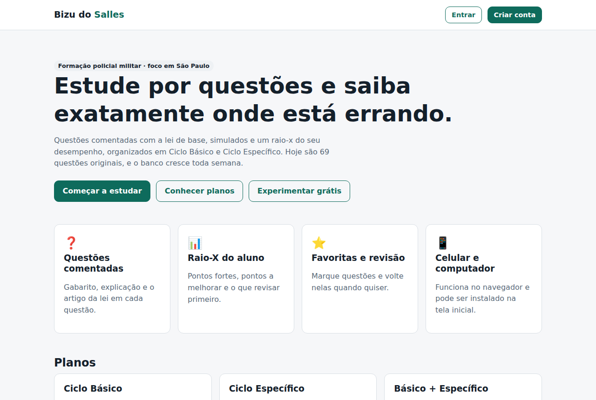
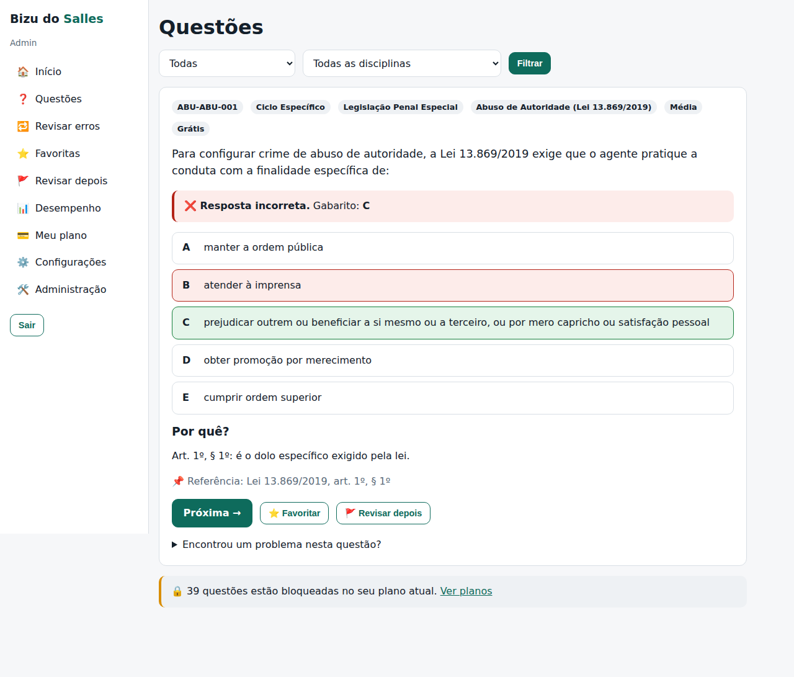
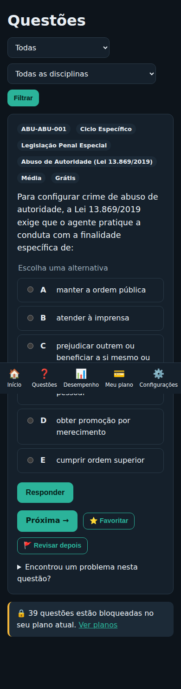

# Bizu do Salles

Plataforma de estudos por questões para a formação da Polícia Militar — **Ciclo Básico**, **Ciclo Específico** e plano **Básico + Específico**. Atende **todos os estados**, com foco inicial em **São Paulo**.

**Versão 0.6.0** — site funcionando: cadastro, login (um aparelho por vez), **178 questões comentadas (109 do RDPM de SP)**, **simulados com cronômetro**, cadernos, ranking, importação por planilha, LGPD, recuperação de senha, meta diária, desempenho com raio-x, favoritas/revisão, planos e painel administrativo completo. [Roteiro](docs/PRODUCT_ROADMAP.md) · [Changelog](CHANGELOG.md)

> 👋 **Começando agora?** Abra o **[Relatório em PDF](docs/RELATORIO.pdf)** — explica o projeto, o glossário e traz o **Guia de edição** (o que mudar e onde). Depois, o [Guia do iniciante](docs/GUIA_INICIANTE.md).
>
> ✏️ **Para editar:** textos do site em `src/config/site.ts`, números/regras em `src/config/regras.ts`. Todo arquivo importante começa com um cabeçalho `📄 O QUE É / ✏️ EDITÁVEL / ⚠️ CUIDADO` — pesquise por `✏️ EDITÁVEL`.

| Página inicial | Questão respondida | Celular (tema escuro) |
|---|---|---|
|  |  |  |

## Rodar em 1 minuto

```bash
cd PROJETOS/bizu-do-salles
npm install
cp .env.example .env
docker compose up -d                 # banco local (ou use um PostgreSQL 16 instalado)
npx prisma migrate deploy && npm run db:seed
npm run admin:create -- seu@email.com "Seu Nome"
npm run dev                          # http://localhost:3000
```

## Documentação

| Documento | Para quê |
|---|---|
| [GUIA_INICIANTE](docs/GUIA_INICIANTE.md) | Glossário, mapa das pastas, "onde eu mudo…", passo a passo |
| [ADMIN_GUIDE](docs/ADMIN_GUIDE.md) | Como usar o painel, papéis, checklist de questão |
| [CONTENT_GUIDE](docs/CONTENT_GUIDE.md) | Como criar questões, regra de direitos autorais, plano de conteúdo SP |
| [SECURITY](docs/SECURITY.md) | O que protege o sistema e o que vem depois |
| [BACKUP](docs/BACKUP.md) | Backup, retenção e recuperação |
| [DEPLOY](docs/DEPLOY.md) | Publicar na internet (Vercel + Neon) |
| [PAYMENTS](docs/PAYMENTS.md) | Pagamento hoje (manual auditado) e Mercado Pago |
| [ARCHITECTURE](docs/ARCHITECTURE.md) · [DATABASE](docs/DATABASE.md) | Decisões técnicas e banco |
| [AUDITORIA](docs/AUDITORIA.md) | Análise inicial, riscos e custos |

## Qualidade

- `npm test` — regras de negócio e validação do banco de questões (18 testes).
- `npm run test:e2e` — navegador real: cadastro, resposta, sessão única, bloqueio sem plano, liberação pelo admin, criação de questão, cabeçalhos de segurança, simulado, recuperação de senha, meta diária, cadernos, ranking, LGPD, importação, papéis (15 testes).
- CI no GitHub roda tudo com PostgreSQL a cada envio.
